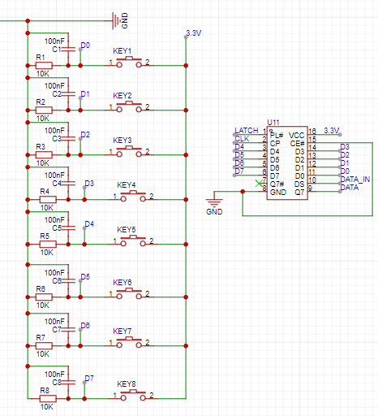

# :hammer: HC165 扫描按键

## 连接
>按键读取方式位高位优先 所以第一个按键为第一个hc165的d7


> :book:20230913 以上接线方法应为 d7 
> 
| hc165管脚      | 对应按键顺序 |
| ----------- | ----------- |
| d7      | KEY_1       |
| d6      | KEY_2       |
| d5      | KEY_3       |
| d4      | KEY_4       |
| d3      | KEY_5       |
| d2      | KEY_6       |
| d1      | KEY_7       |
| d0      | KEY_8       |

:hammer:这样设置让keymap可以顺序书写不用倒叙书写


## 关联库

```c
#include "hc165.h"
```

## 配置

```c
#define DATA 25 //数据
#define CLOCK 26 //时钟
#define LATCH 27 //latch引脚
#define key_nums 8 //按键数量

//hc165结构体
HC165_typeDef hc165 = {
  .data_pin = DATA,
  .clock_pin = CLOCK,
  .latch_pin = LATCH,
  .key_num = key_nums,
};

//按键显示内容(非必要)
KEYMAP_typeDef key_map[] = 
{
  {'1'},//对应d7
  {'2'},//对应d6....
  {'3'},
  {'4'},
  {'5'},
  {'6'},
  {'7'},
  {'8'},
};

//实体化按键
BTN165_typeDef btn165[key_nums];

//weak定义函数
void  press_handler()
{
  //按下函数(一般用于键盘)  
  Serial.println("press:(in main.cpp)");
}
//weak定义函数
void  release_handler()
{
  //释放函数  
  Serial.println("release:(in main.cpp)");
};

```

## 使用
```c
void setup() {
  hc165_init(&hc165,btn165,key_nums);
  
}

void loop() {
  hc165_scan(&hc165,key_map,btn165);
}
```

