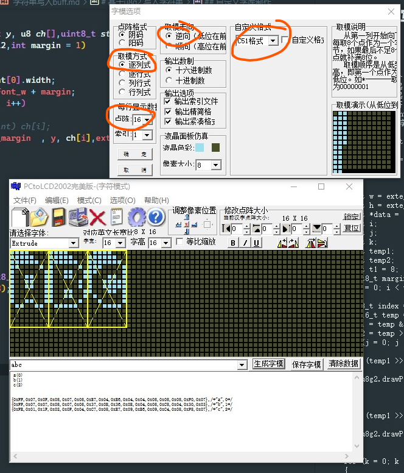

# 基于u8g2 写入字符串


## 写入单个字符

```c
/**
 * @brief 写单一个字符
 * @param x 字符起始x坐标
 * @param y 字符起始y坐标
 * @param str 字符
 * @param exte_font 字体
 * @param margin 字符间距
*/
void writeChar(int x, int y, char str,custom_font_t *exte_font = exte_font_10x12)
{
  int str_offset = 65;//0开始的偏移量
  int str_index = str - str_offset; // 字符在数组中的索引

  
  uint8_t w = exte_font[str_index].width;
  uint8_t h = exte_font[str_index].height;
  uint8_t *data = exte_font[str_index].data;
  uint8_t i;
  uint8_t j;
  uint8_t k;
  uint8_t temp1;
  uint8_t temp2;
  uint8_t t1 = 8;
  // uint8_t margin = 2;
  for (i = 0; i < w; i++)
  {
    uint8_t index = 2 * i ;
    uint16_t temp = (data[index+1] << 8 | data[index]);    // 缓存当前图片+偏移量
    temp1 = temp & 0xff;                          // 取低8位
    temp2 = temp >> 8 & 0xff;                     // 取高8位
    for (j = 0; j < t1; j++)                      // 画低8位
    {
      if (temp1 >> j & 0x01)
      {
        u8g2.drawPixel(x + i, y + j);
      }
    }
    {
      if (temp1 >> j & 0x01)
      {
        u8g2.drawPixel(x + i, y + j);
      }
    }
    for (k = 0; k < h - 8; k++) // 画高8位
    {
      if (temp2 >> k & 0x01)
      {
        u8g2.drawPixel(x + i, y + k + 8);
      }
    }
  }
}
```

## 写入字符串

```c
/**
 * @brief 写字符串
 * @param x 字符串起始x坐标
 * @param y 字符串起始y坐标
 * @param ch 字符串
 * @param str_len 字符串长度
 * @param exte_font 字体
 * @param margin 字符间距
*/
void writeString(int x, int y, u8 ch[],uint8_t str_len,custom_font_t *exte_font = exte_font_10x12,int margin = 1)
{
  uint8_t i;
  uint8_t font_w = exte_font[0].width;
  uint8_t font_w_margin = font_w + margin;
  for(i = 0 ; i < str_len ; i++)
  {
    // int ascii_value = (int) ch[i];
    writeChar(x + i*font_w_margin  , y, ch[i],exte_font);
  }
  
  
}
```

## 使用

```c
    u8g2.clearBuffer();
    char msg[] = "ABCD";
    writeString(10,10,(uint8_t*)msg,4,exte_font_10x12_2);
    u8g2.drawBox(0, 0, 8, 8);
    u8g2.sendBuffer();
```


## 自定义字库制作



取模方法`序列式`
占阵为宽度的2倍

字符
```c
#ifndef CUSTOM_FONT_H
#define CUSTOM_FONT_H
#include "Arduino.h"
//单个数据
uint8_t c_a_10_12[] = {0xFF, 0x00, 0x07, 0x01, 0x03, 0x01, 0x03, 0x01, 0xB3, 0x00, 0xB2, 0x00, 0x02, 0x01, 0x04, 0x01, 0xF8, 0x00, 0xF8, 0x00}; /*"A",0*/
uint8_t c_b_10_12[] = {0xFF, 0x00, 0x03, 0x01, 0x03, 0x01, 0x03, 0x01, 0xDB, 0x01, 0xDA, 0x01, 0x02, 0x01, 0xB4, 0x00, 0xD8, 0x00, 0xD8, 0x00}; /*"B",1*/
uint8_t c_c_10_12[] = {0x7E, 0x00, 0x8F, 0x00, 0x87, 0x00, 0x87, 0x00, 0x33, 0x01, 0x73, 0x01, 0x72, 0x01, 0x32, 0x01, 0xB4, 0x00, 0xFC, 0x00}; /*"C",2*/
uint8_t c_d_10_12[] = {0xFF, 0x00, 0x03, 0x01, 0x03, 0x01, 0x03, 0x01, 0x73, 0x01, 0x72, 0x01, 0x32, 0x01, 0x84, 0x00, 0x88, 0x00, 0xF8, 0x00}; /*"D",3*/

//结构体
typedef struct
{
    uint8_t *data;
    uint8_t width;
    uint8_t height;
} custom_font_t;

custom_font_t exte_font_10x12[]{
    {c_a_10_12, 10, 12},
    {c_b_10_12, 10, 12},
    {c_c_10_12, 10, 12},
    {c_d_10_12, 10, 12},
};

#endif
```
