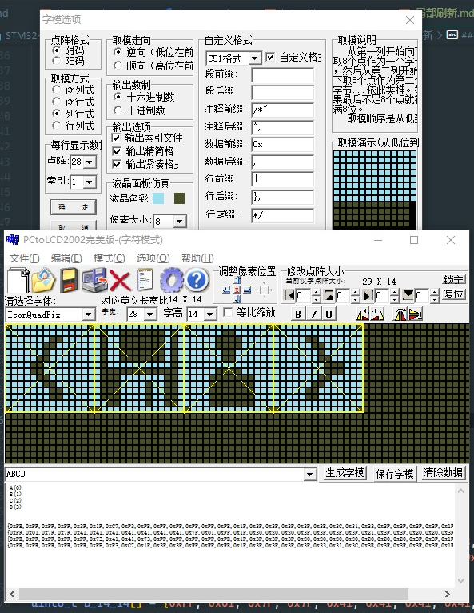

# :hammer: u8g2 局部刷新

### 定义一块刷新区域

```c
uint8_t pic_buff2[64];//可以适当增加内存占用 例如 宽 16 高 12(占据2行) 等于 16*2 = 32 
uint8_t pic_buff_width = 14;//max 128
uint8_t pic_buff_height = 14;//max 16 2行
```
刷新方法为 `列_行 式`

软件 `pctolcd2002`

### 根据`列_行 式`刷新buff到u8g2的主buff中

```c
void send_picbuff(int x, int y, int w, int h, u8 picbuff[])
{
  uint8_t i;
  uint8_t j;
  uint8_t k;
  uint8_t temp1;//缓存 低8
  uint8_t temp2;//缓存 高8
  uint8_t t1 = 8;

  for (i = 0; i < w; i++)  
  {

    temp1 = picbuff[i];
    temp2 = picbuff[w + i];
    /** 
    /* 高度不满16的话会产生多余的空白
    /* 所以只需要高度中的数据其他为0
    **/
    temp2 &= 0xff >> 8 - (h - 8);

    //!  刷新第一行
    for (j = 0; j < t1; j++)
    {
      if (temp1 >> j & 0x01)
      {
        u8g2.drawPixel(x + i, y + j);
      }
    }
    //!  刷新第二行
    for (k = 0; k < h - 8; k++)
    {
      if (temp2 >> k & 0x01 == 1)
      {
        u8g2.drawPixel(x + i, y + k + 8);
      }
    }
  }
}
```

### 字符icon
`custom_font.h`

取模方法


```c
#ifndef CUSTOM_FONT_H
#define CUSTOM_FONT_H
#include "Arduino.h"


uint8_t A_14_14[] = {0xFE, 0xFF, 0xFF, 0xFF, 0x3F, 0x1F, 0xC7, 0xF3, 0xFB, 0xFF, 0xFF, 0xFF, 0xFF, 0xFE, 0x1F, 0x3F, 0x3F, 0x3F, 0x3F, 0x3E, 0x3C, 0x31, 0x33, 0x3F, 0x3F, 0x3F, 0x3F, 0x1F} /*"A",0*/;

uint8_t B_14_14[] = {0xFF, 0x01, 0x7F, 0x7F, 0x41, 0x41, 0x41, 0x41, 0x41, 0x41, 0x41, 0x7F, 0x01, 0xFF, 0x1F, 0x30, 0x20, 0x20, 0x3F, 0x3F, 0x3F, 0x3F, 0x21, 0x3F, 0x3F, 0x20, 0x20, 0x3F}; /*"B",1*/

uint8_t C_14_14[] = {0xFE, 0xFF, 0xFF, 0xFF, 0xFF, 0x73, 0x41, 0x41, 0x73, 0xFF, 0xFF, 0xFF, 0xFF, 0xFE, 0x1F, 0x3F, 0x3F, 0x3F, 0x20, 0x20, 0x20, 0x20, 0x20, 0x20, 0x20, 0x3F, 0x3F, 0x1F}; /*"C",2*/

uint8_t D_14_14[] = {0xFE, 0xFF, 0xFF, 0xFF, 0xFF, 0xFB, 0xF3, 0xC7, 0x1F, 0x3F, 0x3F, 0xFF, 0xFF, 0xFE, 0x1F, 0x3F, 0x3F, 0x3F, 0x3F, 0x33, 0x31, 0x3C, 0x3E, 0x3F, 0x3F, 0x3F, 0x3F, 0x1F}; /*"D",3*/

//结构体 方便转换字体
typedef struct
{
  uint8_t width;
  uint8_t height;
  unsigned char *data;
} u8g2_fontbuff_t;


#endif
```


### 字符icon 写入到picbuff中

生成一个buff结构体
```c
u8g2_fontbuff_t icon_1 = {14,14,A_14_14};
```

静态显示

```c

uint8_t pic_buff2[32];
u8g2_fontbuff_t boxbuff = {14,14,pic_buff2};

/**
 * @brief 图片滚动
 * @author kazawan
 * @date 2021-01-27
 * @param box 当前图片
 * @param box_next 下一张图片
 * @param picbuff 保存图片的数组
 * @param y_offset 图片滚动的偏移量
 * @param direction 图片滚动的方向 0 下到上 1 上到下
*/
void icon_show(u8g2_box_t *box, unsigned char y_offset,u8g2_box_t *pic_buff)
{
  u8 i, j;
  u8 w = box->width;  //! 图片宽度 需修改
  u8 h = box->height; //! 图片高度 需修改
  u16 temp;

  for (i = 0; i < w; i++)
  {
    temp = box->data[w + i] << 8 | box->data[i];
    temp = temp << y_offset;
    pic_buff->data[i] = (temp)&0xff;
    pic_buff->data[i + w] = (temp >> 8) & 0xff;
  }
}


//! 执行
  u8g2.clearBuffer();
  icon_show(&box1, 0,&box_buff2);//icon 写到局部buff
  send_picbuff(10, 10, 14, 14, pic_buff2);// 刷新到主buff
  send_picbuff(50, 10, 14, 14, pic_buff2);// 刷新到主buff
  u8g2.sendBuffer();
```

动态显示

```c

uint8_t pic_buff2[32];
u8g2_fontbuff_t boxbuff = {14,14,pic_buff2};

void icon_run3(u8g2_box_t *box, u8g2_box_t *box_next,u8g2_box_t *picbuff, unsigned char y_offset, uint8_t direction = 0)
{
  u8 i, j;
  u8 w = box->width;  
  u8 h = box->height; 
  u8 margin = 2;
  u16 boxpic;

  for (i = 0; i < w; i++)
  {
    u16 boxpic_next = (box_next->data[w + i] << 8 | box_next->data[i]);
    if (direction == 0)
    {
      // todo 下到上滚
      boxpic = (box->data[w + i] << 8 | box->data[i]) >> y_offset;
      boxpic |= boxpic_next << (h - y_offset + margin);
    }
    if (direction == 1)
    {
      // todo 上到下滚
      boxpic = (box->data[w + i] << 8 | box->data[i]) << y_offset;
      boxpic |= boxpic_next >> (h - y_offset + margin);
    }

    picbuff->data[i] = (boxpic)&0xff;
    picbuff->data[i + w] = (boxpic >> 8) & 0xff;
  }
}

//! 执行
    if (done_flag == 0 && n != n_trg)
  {
    animation(&n, &n_trg, 96);//动画插值y offset
  }

  if (n == n_trg)
  {
    if (done_flag == 0)
    {
      flag++;
    }

    if (flag >= 4)
      flag = 0;
    if (flag == 0)
    {

      box1.data = A_14_14;
      box2.data = B_14_14;
      n = 0;
    }
    if (flag == 1)
    {
      box1.data = B_14_14;
      box2.data = C_14_14;
      n = 0;
    }
    if (flag == 2)
    {
      box1.data = C_14_14;
      box2.data = D_14_14;
      n = 0;
    }
    if (flag == 3)
    {
      box1.data = D_14_14;
      box2.data = A_14_14;
      done_flag = 1;
      n = 0;
    }
    delay(500);

    // box1.data = B_14_14;
    // box2.data = C_14_14;
  }
  u8g2.clearBuffer();

  icon_run3(&box1, &box2,&box_buff2,n, 1);
  send_picbuff(10, 10, 14, 14, pic_buff2);
  send_picbuff(50, 10, 14, 14, pic_buff2);
  u8g2.drawBox(0, 0, 8, 8);
  u8g2.sendBuffer();


```

### 不用定义缓存直接写入u8g2缓存 

```c
/**
 * @brief 发送图片数组
 * @param x 图片起始x坐标
 * @param y 图片起始y坐标
 * @param pic 图片数组
 * @param pic_next 下一张图片数组
 * @param y_offset 图片滚动的偏移量  默认0 
*/
void send_picbuff_roll(int x, int y,u8g2_box_t *pic, u8g2_box_t *pic_next ,unsigned char y_offset = 0)
{
  uint8_t i;
  uint8_t j;
  uint8_t k;
  uint8_t temp1;
  uint8_t temp2;
  uint8_t h = pic->height;
  uint8_t w = pic->width;
  uint8_t t1 = 8;
  uint8_t margin = 2;
  for (i = 0; i < w; i++)
  {
    uint16_t temp = (pic->data[w + i] << 8 | pic->data[i]) << y_offset; //缓存当前图片+偏移量
    uint16_t temp_next = (pic_next->data[w + i] << 8 | pic_next->data[i]); // 下一张图片
    
    temp |= temp_next >> (h - y_offset + margin); // 下一张图片的高位补到当前图片的低位
    temp1 = temp & 0xff; // 取低8位
    temp2 = temp >> 8 & 0xff; // 取高8位
    for (j = 0; j < t1; j++) // 画低8位
    {
      if (temp1 >> j & 0x01)
      {
        u8g2.drawPixel(x + i, y + j);
      }
    }
    {
      if (temp1 >> j & 0x01)
      {
        u8g2.drawPixel(x + i, y + j);
      }
    }
    for (k = 0; k < h - 8; k++) // 画高8位
    {
      if (temp2 >> k & 0x01 )
      {
        u8g2.drawPixel(x + i, y + k + 8);
      }
    }
  }
}
```


