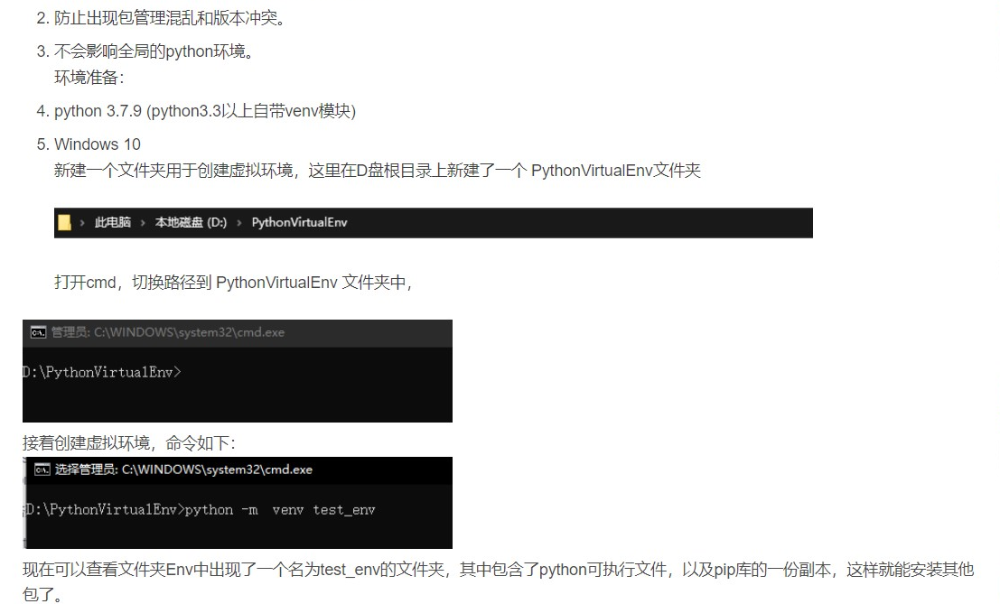
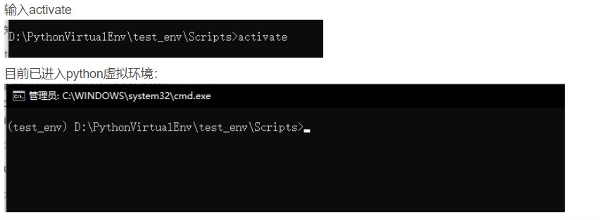

# :computer: PYTHON 虚拟环境

> :book:参考网址
> [pyinstaller打包的exe太大而且运行太慢--简单的解决办法](https://blog.csdn.net/m0_47472749/article/details/124426544)

##  新建虚拟环境文件夹

 使用管理员打开`cmd.exe`
切换路径到 `PythonVirtualEnv` 文件夹中
cmd输入   `python -m venv test_env`
切换路径到 `PythonVirtualEnv\test_env` 文件夹中
cmd输入 `activate`

>最后安装需要的库
:smile:pyinstaller 打包不出现cmd控制台的命令

`pyinstaller -F mycode.py --noconsole `

### 成功打包:shit:
