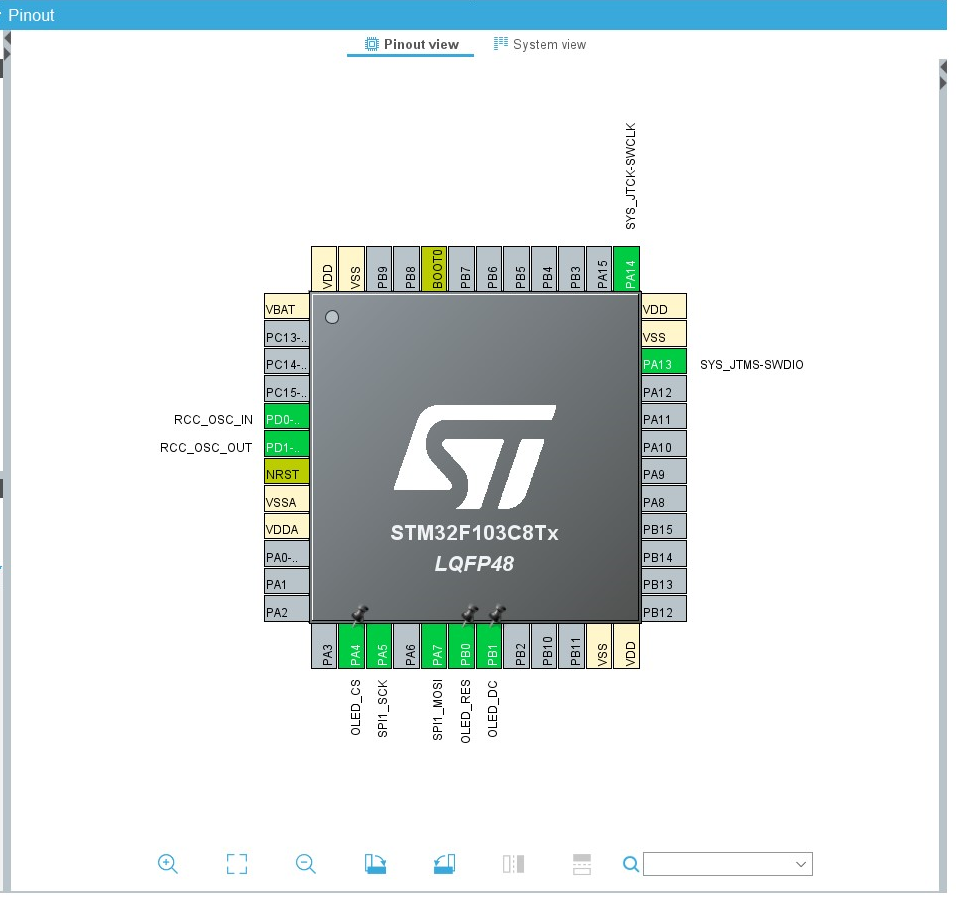
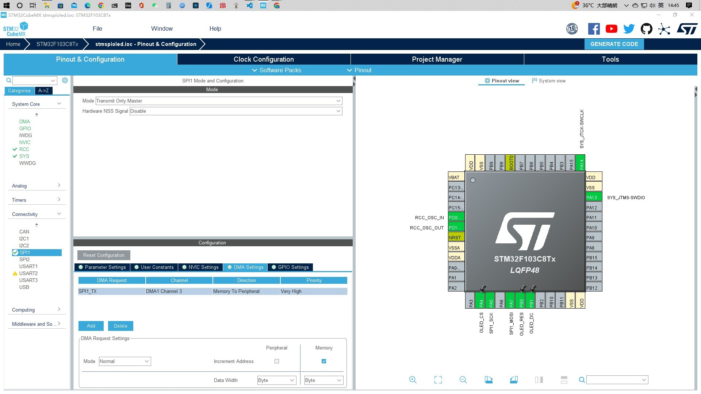
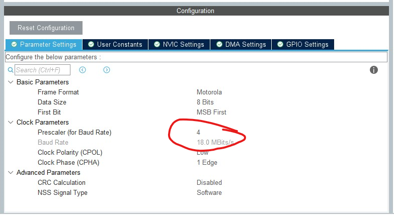

## :hammer:STM32 U8G2 移植

* 参考
[U8g2库的STM32硬件SPI（DMA）移植教程（HAL、OLED显示、四线SPI、DMA](https://blog.csdn.net/qq_51096702/article/details/130185443)


#### :link:接线
```c
//----------------------------------------------------------------
本次用的是SPI1、DMA、全双工(当然半双工也没什么问题、CS、DC、RS是普通GPIO，自行切换)
GND -----------> 电源地
VCC -----------> 接5V或3.3v电源
D0 -----------> 接PA5（SCL）
D1 -----------> 接PA7（SDA）
RES -----------> 接PB0
DC -----------> 接PB1
CS -----------> 接PA4              
//----------------------------------------------------------------
```



#### :gear:CUBEMX 配置


配置spi1 
>PA5 CLK
>PA7 MOSI
>mode 选用半双工(只发送)
>dma 只增加spi1_tx
>res pb0 output pp 速度low
>DC pb1 output pp 速度low
>CS pa4 output pp 速度HIGH


--------
>SPI 发送速度设置


#### :book:新建`OLED.c`

```c
#include "./Core/Inc/oled_driver.h"
#include "stdlib.h"
#include "spi.h"
#include "dma.h"
#include "./Core/Src/u8g2/u8g2.h"

uint8_t u8x8_byte_4wire_hw_spi(u8x8_t *u8x8, uint8_t msg, uint8_t arg_int,void *arg_ptr)
{
    switch (msg)
    {
        case U8X8_MSG_BYTE_SEND: /*通过SPI发送arg_int个字节数据*/
          HAL_SPI_Transmit_DMA(&hspi1, (uint8_t *)arg_ptr, arg_int);while(hspi1.TxXferCount);
			/*配置了DMA取消上一行注释即可*/
			// HAL_SPI_Transmit(&hspi1,(uint8_t *)arg_ptr,arg_int,200);
			/*这是CubeMX生成的初始化*/
            break;
        case U8X8_MSG_BYTE_INIT: /*初始化函数*/
            break;
        case U8X8_MSG_BYTE_SET_DC: /*设置DC引脚,表明发送的是数据还是命令*/
			HAL_GPIO_WritePin(OLED_DC_GPIO_Port,OLED_DC_Pin,arg_int);
            break;
        case U8X8_MSG_BYTE_START_TRANSFER: 
            u8x8_gpio_SetCS(u8x8, u8x8->display_info->chip_enable_level);
            u8x8->gpio_and_delay_cb(u8x8, U8X8_MSG_DELAY_NANO, u8x8->display_info->post_chip_enable_wait_ns, NULL);
            break;
        case U8X8_MSG_BYTE_END_TRANSFER: 
            u8x8->gpio_and_delay_cb(u8x8, U8X8_MSG_DELAY_NANO, u8x8->display_info->pre_chip_disable_wait_ns, NULL);
            u8x8_gpio_SetCS(u8x8, u8x8->display_info->chip_disable_level);
            break;
        default:
            return 0;
    }
    return 1;
}

uint8_t u8x8_stm32_gpio_and_delay(U8X8_UNUSED u8x8_t *u8x8,
    U8X8_UNUSED uint8_t msg, U8X8_UNUSED uint8_t arg_int,
    U8X8_UNUSED void *arg_ptr) 
{
    switch (msg)
    {
        case U8X8_MSG_GPIO_AND_DELAY_INIT: /*delay和GPIO的初始化，在main中已经初始化完成了*/
            break;
        case U8X8_MSG_DELAY_MILLI: /*延时函数*/
            HAL_Delay(arg_int);     //调用谁stm32系统延时函数
            break;
        case U8X8_MSG_GPIO_CS: /*片选信号*/ //由于只有一个SPI设备，所以片选信号在初始化时已经设置为常有效
            HAL_GPIO_WritePin(OLED_CS_GPIO_Port, OLED_CS_Pin, arg_int);
            break;
        case U8X8_MSG_GPIO_DC: /*设置DC引脚,表明发送的是数据还是命令*/
            HAL_GPIO_WritePin(OLED_DC_GPIO_Port,OLED_DC_Pin,arg_int);
            break;
        case U8X8_MSG_GPIO_RESET:
            break;
    }
    return 1;
}

void u8g2Init(u8g2_t *u8g2)
{
/********************************************     
U8G2_R0     //不旋转，不镜像     
U8G2_R1     //旋转90度
U8G2_R2     //旋转180度   
U8G2_R3     //旋转270度
U8G2_MIRROR   //没有旋转，横向显示左右镜像
U8G2_MIRROR_VERTICAL    //没有旋转，竖向显示镜像
********************************************/
//    u8g2_Setup_sh1106_128x64_noname_2(u8g2, U8G2_R0, u8x8_byte_4wire_hw_spi, u8x8_stm32_gpio_and_delay);  // 初始化1.3寸OLED u8g2 结构体
	u8g2_Setup_ssd1306_128x64_noname_f(u8g2, U8G2_R0, u8x8_byte_4wire_hw_spi, u8x8_stm32_gpio_and_delay);  // 初始化0.96寸OLED u8g2 结构体
	u8g2_InitDisplay(u8g2);     //初始化显示
	u8g2_SetPowerSave(u8g2, 0); //开启显示
}

```
#### :book:新建`oled_driver.h`

```c

#include "stdlib.h"	  
#include "main.h"
#include "gpio.h"
#include "./Core/Src/u8g2/u8g2.h"

//-----------------OLED端口定义----------------  					   
#define MD_OLED_RST_Clr() HAL_GPIO_WritePin(OLED_RES_GPIO_Port,OLED_RES_Pin,GPIO_PIN_RESET) //oled 复位端口操作
#define MD_OLED_RST_Set() HAL_GPIO_WritePin(OLED_RES_GPIO_Port,OLED_RES_Pin,GPIO_PIN_SET)

//OLED控制用函数
uint8_t u8x8_byte_4wire_hw_spi(u8x8_t *u8x8, uint8_t msg, uint8_t arg_int,void *arg_ptr);
uint8_t u8x8_stm32_gpio_and_delay(U8X8_UNUSED u8x8_t *u8x8,U8X8_UNUSED uint8_t msg, U8X8_UNUSED uint8_t arg_int,U8X8_UNUSED void *arg_ptr) ;
void u8g2Init(u8g2_t *u8g2);
void draw(u8g2_t *u8g2);

#endif  
```


#### :computer:`main.c`

```c
  /* USER CODE BEGIN 2 */
  u8g2_t u8g2;       // 显示器初始化结构�??
  MD_OLED_RST_Set(); // 显示器复位拉�??
  u8g2Init(&u8g2);   // 显示器调用初始化函数
  /* USER CODE END 2 */


while(1)
{
    /* USER CODE BEGIN 3 */
    u8g2_ClearBuffer(&u8g2); // 清屏

    u8g2_DrawStr(&u8g2, 0, point[0].y, "kazawan"); // 显示字符�??

    u8g2_SendBuffer(&u8g2); // 发�?�缓冲区内容到显示器
    
}
  /* USER CODE END 3 */
```

