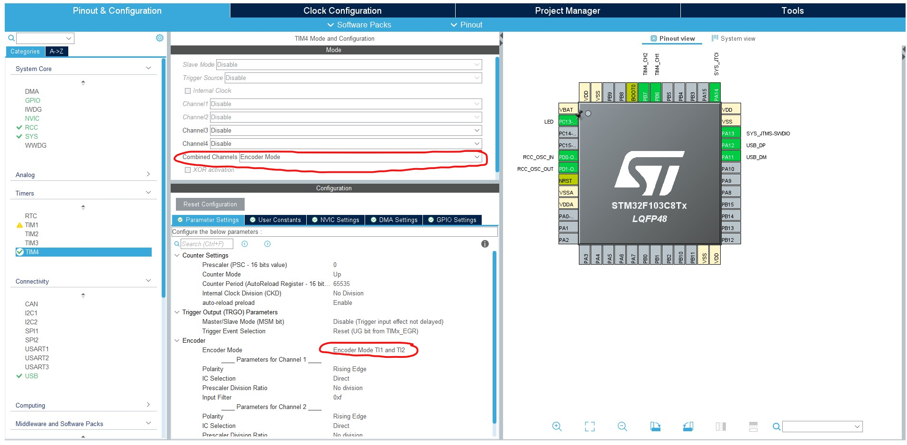
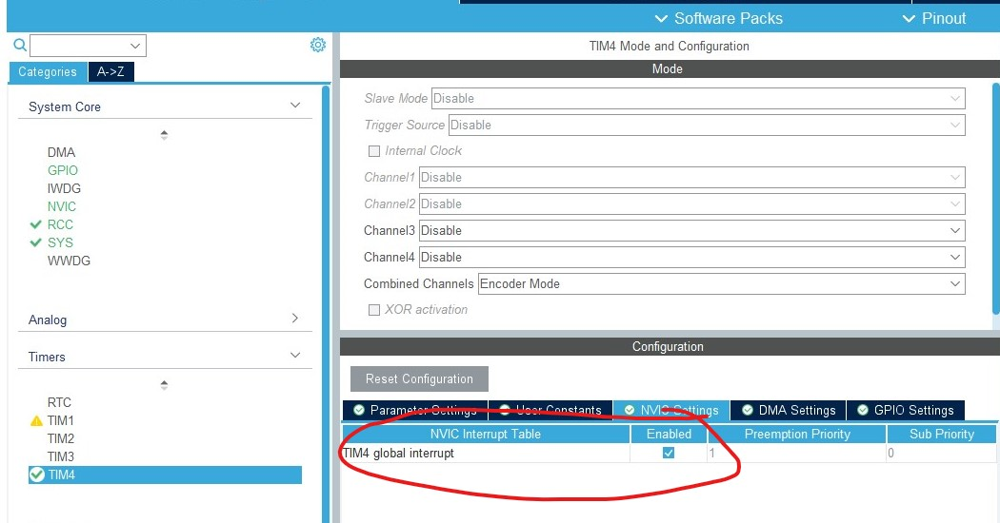

# Stm32 定时器Encoder模式

## 配置


## 中断配置

如与其他中断冲突..要考虑其优先级

## 初始化中断
```c
//在main里面 while之前
HAL_TIM_Encoder_Start_IT(&htim4, TIM_CHANNEL_1 | TIM_CHANNEL_2);
```

## 中断回调

```c
//弱定义 可以重新定义
void HAL_TIM_IC_CaptureCallback(TIM_HandleTypeDef *htim);
```

## 获取计算器

```c
//注意是uint32_t
uint32_t counter = 0;
counter = __HAL_TIM_GET_COUNTER(&htim4);
```

## 获取方向

```c
// 0 逆时针  1 顺时针 2 表示不动
uint8_t dir = 2;
dir = __HAL_TIM_IS_TIM_COUNTING_DOWN(&htim4); 
```


## example

```c
/* USER CODE BEGIN Header */
/**
 ******************************************************************************
 * @file           : main.c
 * @brief          : Main program body
 ******************************************************************************
 * @attention
 *
 * Copyright (c) 2023 STMicroelectronics.
 * All rights reserved.
 *
 * This software is licensed under terms that can be found in the LICENSE file
 * in the root directory of this software component.
 * If no LICENSE file comes with this software, it is provided AS-IS.
 *
 ******************************************************************************
 */
/* USER CODE END Header */
/* Includes ------------------------------------------------------------------*/
#include "main.h"
#include "tim.h"
#include "usb_device.h"
#include "gpio.h"

/* Private includes ----------------------------------------------------------*/
/* USER CODE BEGIN Includes */
#include "usbd_cdc_if.h"
#include "stdio.h"
#include "string.h"
#include "stdlib.h"
#include "math.h"
/* USER CODE END Includes */

/* Private typedef -----------------------------------------------------------*/
/* USER CODE BEGIN PTD */

/* USER CODE END PTD */

/* Private define ------------------------------------------------------------*/
/* USER CODE BEGIN PD */

/* USER CODE END PD */

/* Private macro -------------------------------------------------------------*/
/* USER CODE BEGIN PM */

/* USER CODE END PM */

/* Private variables ---------------------------------------------------------*/

/* USER CODE BEGIN PV */

/* USER CODE END PV */

/* Private function prototypes -----------------------------------------------*/
void SystemClock_Config(void);
/* USER CODE BEGIN PFP */

/* USER CODE END PFP */

/* Private user code ---------------------------------------------------------*/
/* USER CODE BEGIN 0 */
uint32_t timer_value = 0;
uint16_t flash_time = 500;
char str[20];
char strend[4] = "\r\n";
 
uint32_t counter = 0;
uint8_t encoder_value = 0;
int dir = -1;
void HAL_TIM_IC_CaptureCallback(TIM_HandleTypeDef *htim)
{
  counter = (__HAL_TIM_GET_COUNTER(&htim4) / 4);
  dir = __HAL_TIM_IS_TIM_COUNTING_DOWN(&htim4); 
  if(dir == 1)
  {
    encoder_value++;
    flash_time += 10;
    if(flash_time > 1000)
    {
      flash_time = 1000;
    }
    dir = -1;
  }
  if(dir == 0)
  {
    encoder_value--;
    flash_time -= 10;
    if(flash_time < 100)
    {
      flash_time = 100;
    }
    dir = -1;
  }
  itoa(encoder_value, str, 10);
  strcat(str, strend);
  
  CDC_Transmit_FS((uint8_t *)str, strlen(str));
};

/* USER CODE END 0 */

/**
  * @brief  The application entry point.
  * @retval int
  */
int main(void)
{
  /* USER CODE BEGIN 1 */

  /* USER CODE END 1 */

  /* MCU Configuration--------------------------------------------------------*/

  /* Reset of all peripherals, Initializes the Flash interface and the Systick. */
  HAL_Init();

  /* USER CODE BEGIN Init */

  /* USER CODE END Init */

  /* Configure the system clock */
  SystemClock_Config();

  /* USER CODE BEGIN SysInit */

  /* USER CODE END SysInit */

  /* Initialize all configured peripherals */
  MX_GPIO_Init();
  MX_TIM4_Init();
  MX_USB_DEVICE_Init();
  /* USER CODE BEGIN 2 */
  HAL_TIM_Encoder_Start_IT(&htim4, TIM_CHANNEL_1 | TIM_CHANNEL_2);
  
  /* USER CODE END 2 */

  /* Infinite loop */
  /* USER CODE BEGIN WHILE */
  while (1)
  {
    /* USER CODE END WHILE */

    /* USER CODE BEGIN 3 */
    if(HAL_GetTick() - timer_value >= flash_time)
    {
      HAL_GPIO_TogglePin(LED_GPIO_Port, LED_Pin);
      timer_value = HAL_GetTick();
    }
    
  }
  /* USER CODE END 3 */
}

/**
  * @brief System Clock Configuration
  * @retval None
  */
void SystemClock_Config(void)
{
  RCC_OscInitTypeDef RCC_OscInitStruct = {0};
  RCC_ClkInitTypeDef RCC_ClkInitStruct = {0};
  RCC_PeriphCLKInitTypeDef PeriphClkInit = {0};

  /** Initializes the RCC Oscillators according to the specified parameters
  * in the RCC_OscInitTypeDef structure.
  */
  RCC_OscInitStruct.OscillatorType = RCC_OSCILLATORTYPE_HSE;
  RCC_OscInitStruct.HSEState = RCC_HSE_ON;
  RCC_OscInitStruct.HSEPredivValue = RCC_HSE_PREDIV_DIV1;
  RCC_OscInitStruct.HSIState = RCC_HSI_ON;
  RCC_OscInitStruct.PLL.PLLState = RCC_PLL_ON;
  RCC_OscInitStruct.PLL.PLLSource = RCC_PLLSOURCE_HSE;
  RCC_OscInitStruct.PLL.PLLMUL = RCC_PLL_MUL9;
  if (HAL_RCC_OscConfig(&RCC_OscInitStruct) != HAL_OK)
  {
    Error_Handler();
  }

  /** Initializes the CPU, AHB and APB buses clocks
  */
  RCC_ClkInitStruct.ClockType = RCC_CLOCKTYPE_HCLK|RCC_CLOCKTYPE_SYSCLK
                              |RCC_CLOCKTYPE_PCLK1|RCC_CLOCKTYPE_PCLK2;
  RCC_ClkInitStruct.SYSCLKSource = RCC_SYSCLKSOURCE_PLLCLK;
  RCC_ClkInitStruct.AHBCLKDivider = RCC_SYSCLK_DIV1;
  RCC_ClkInitStruct.APB1CLKDivider = RCC_HCLK_DIV2;
  RCC_ClkInitStruct.APB2CLKDivider = RCC_HCLK_DIV1;

  if (HAL_RCC_ClockConfig(&RCC_ClkInitStruct, FLASH_LATENCY_2) != HAL_OK)
  {
    Error_Handler();
  }
  PeriphClkInit.PeriphClockSelection = RCC_PERIPHCLK_USB;
  PeriphClkInit.UsbClockSelection = RCC_USBCLKSOURCE_PLL_DIV1_5;
  if (HAL_RCCEx_PeriphCLKConfig(&PeriphClkInit) != HAL_OK)
  {
    Error_Handler();
  }
}

/* USER CODE BEGIN 4 */

/* USER CODE END 4 */

/**
  * @brief  This function is executed in case of error occurrence.
  * @retval None
  */
void Error_Handler(void)
{
  /* USER CODE BEGIN Error_Handler_Debug */
  /* User can add his own implementation to report the HAL error return state */
  __disable_irq();
  while (1)
  {
  }
  /* USER CODE END Error_Handler_Debug */
}

#ifdef  USE_FULL_ASSERT
/**
  * @brief  Reports the name of the source file and the source line number
  *         where the assert_param error has occurred.
  * @param  file: pointer to the source file name
  * @param  line: assert_param error line source number
  * @retval None
  */
void assert_failed(uint8_t *file, uint32_t line)
{
  /* USER CODE BEGIN 6 */
  /* User can add his own implementation to report the file name and line number,
     ex: printf("Wrong parameters value: file %s on line %d\r\n", file, line) */
  /* USER CODE END 6 */
}
#endif /* USE_FULL_ASSERT */
```


