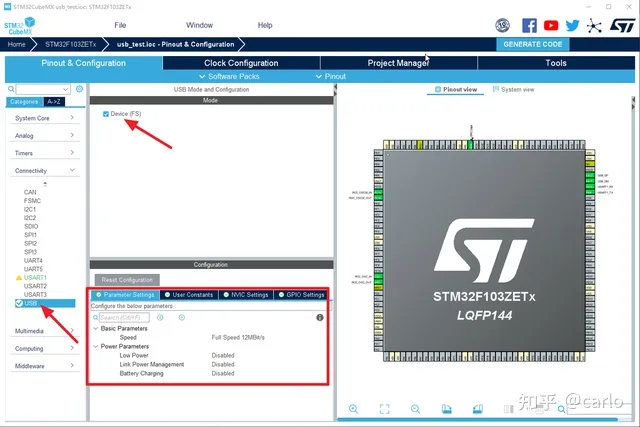
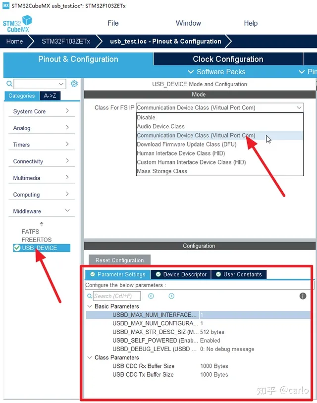

# STM32 USB CDC虚拟串口

[知乎参考](https://zhuanlan.zhihu.com/p/371849774?utm_id=0)

><font color="red" size="4">注意要在官网下载驱动!!!! [DRIVER下载地址](https://www.stmcu.com.cn/Designresource/detail/firmware_software/709654)
### cubemx配置






### platformio ini 配置

```ini
[platformio]
src_dir = ./
include_dir = Core/Inc

[env:genericSTM32F103C8]
platform = ststm32
board = genericSTM32F103C8
; framework = stm32cube
build_flags = 
	-D STM32F103xx
	-ICore/Inc
	-IDrivers/CMSIS/Include
	-IDrivers/CMSIS/Device/ST/STM32F1xx/Include
	-IDrivers/STM32F1xx_HAL_Driver/Inc
	-IDrivers/STM32F1xx_HAL_Driver/Inc/Legacy
	-IUSB_DEVICE/App
	-IUSB_DEVICE/Target 
	-IMiddlewares/ST/STM32_USB_Device_Library/Core/Inc
	-IMiddlewares/ST/STM32_USB_Device_Library/Class/CDC/Inc
src_filter = +<Core/Src> +<startup_stm32f103xb.s> +<Drivers/> +<Middlewares/>+<USB_DEVICE/>

board_build.ldscript = ./STM32F103C8Tx_FLASH.ld
upload_protocol = stlink 
debug_tool = stlink
```


### usbd_cdc_if.c 应用层操作

#### usb接收
`static int8_t CDC_Receive_FS(uint8_t* Buf, uint32_t *Len)` 
只能在内部使用自带中断默认开启

#### usb发送
`uint8_t CDC_Transmit_FS(uint8_t* Buf, uint16_t Len)`
可以外部使用 
中断使用以后补充


