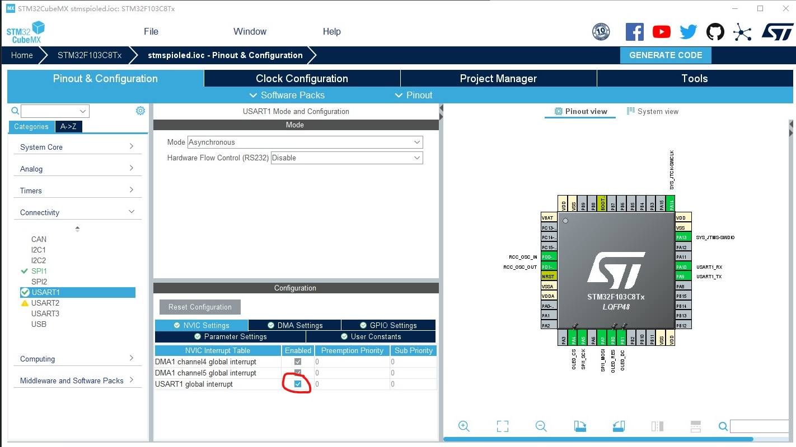

# :ear: Stm32 串口操作

## 1:接收 `定长` 配置

### 配置cubemx

注意配置 `nvic` 全局中断



> 如使用中断接收 只需改变为`HAL_UART_Receive_IT()` `HAL_UART_Transmit_IT()` 即可
> :book:`HAL_UART_Receive_IT()` 需要添加size
```c
uint8_t rev_data[4] = "NOMS"; // 全局变量

HAL_UART_Receive_DMA(&huart1, rev_data, 4);//在while前产生一次
```


接收中断  `HAL_UART_RxCpltCallback(UART_HandleTypeDef *huart)`
```c
void HAL_UART_RxCpltCallback(UART_HandleTypeDef *huart)
{
  if(huart->Instance == USART1)
  { 
    //把接收到的信息返回打印
    HAL_UART_Transmit_DMA(&huart1, rev_data, 4);
    
  }
  //关闭过半中断
  
  //重新启动一次接收任务
  HAL_UART_Receive_DMA(&huart1, rev_data, 4);
}
```


## 2:接收 `不定长` 配置
### 配置cubemx
同上

```c
uint8_t rev_data2[50] = "NOMS";

HAL_UARTEx_ReceiveToIdle_DMA(&huart1, rev_data2, sizeof(rev_data2));
```

接收空闲中断 `void HAL_UARTEx_RxEventCallback(UART_HandleTypeDef *huart, uint16_t Size)`
```c
void HAL_UARTEx_RxEventCallback(UART_HandleTypeDef *huart, uint16_t Size)
{
  if(huart == &huart1)
  {

    HAL_UART_Transmit_DMA(&huart1, rev_data2, Size);
    point[0].y = 0;
  }

  HAL_UARTEx_ReceiveToIdle_DMA(&huart1, rev_data2, sizeof(rev_data2));
};
```


